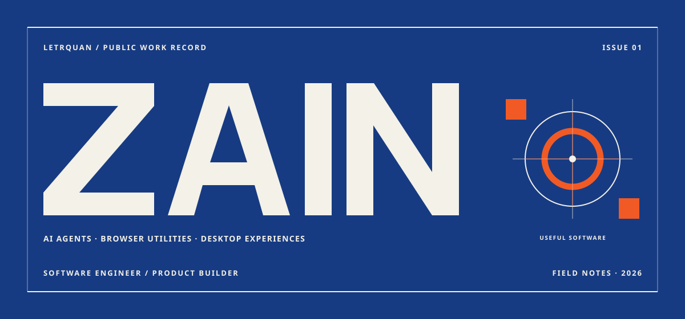
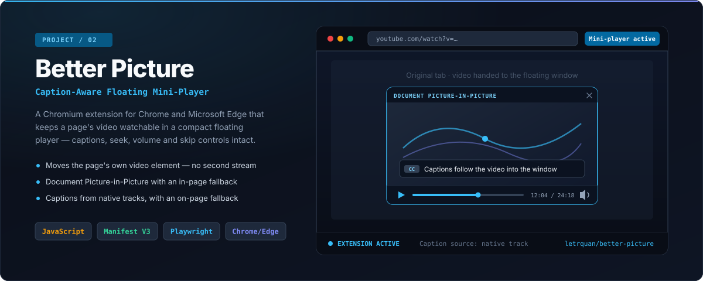

  

  <strong>Zain</strong> · <code>@letrquan</code> 
  I build developer tools — AI coding agents, browser utilities, and Windows desktop apps.

  <a href="https://github.com/letrquan/book">Book CLI</a> ·
  <a href="https://github.com/letrquan/better-picture">Better Picture</a> ·
  <a href="https://github.com/letrquan/v-voice-claude">V Voice</a> ·
  <a href="https://github.com/letrquan?tab=repositories">All repositories</a>

---

## Selected work

### Book CLI — provider-agnostic AI coding agent

  

A terminal coding agent that is not tied to one model vendor. It speaks the Anthropic Messages API and any OpenAI-compatible endpoint, loads `AGENTS.md` and `CLAUDE.md` project instructions, and keeps a file-based memory store with an explicit approval step before anything is written. Sessions persist as append-only JSONL, so `--resume`, `/compact`, and `/rewind` all work against real history. Subagents run in isolated git worktrees and hand back reviewable patches.

**Stack** `TypeScript` · `React Ink` · `Node.js` · `MCP` &nbsp;&nbsp; **Repo** [letrquan/book](https://github.com/letrquan/book)

### Better Picture — caption-aware floating mini-player

  

Browser-native Picture-in-Picture drops your captions and most of your controls. This extension finds the best visible video on a page and moves the actual video element into a Document Picture-in-Picture window — no second stream, no lost playback state. Captions come from the native track where one exists and fall back to scraping on-page caption containers, including YouTube's. When the browser has no Document PiP support, it degrades to a draggable in-page mini-player.

**Stack** `JavaScript` · `Manifest V3` · `Playwright` · `Chrome / Edge` &nbsp;&nbsp; **Repo** [letrquan/better-picture](https://github.com/letrquan/better-picture)

### V Voice — floating Windows dictation widget

  

An always-on-top pill widget that transcribes speech and types it into whatever window has focus. Whisper runs locally through `whisper.cpp` or in the cloud via OpenAI or Groq, so it works without a network connection and without a GPU. Voice activity detection handles start and stop automatically, partial transcripts stream while you speak, and Vietnamese tone marks and diacritics get dedicated prompt handling. The pill remembers its position per monitor.

**Stack** `Rust` · `Tauri 2` · `React` · `Whisper` &nbsp;&nbsp; **Repo** [letrquan/v-voice-claude](https://github.com/letrquan/v-voice-claude)

---

## What I work on

| Area | Stack | In practice |
| :--- | :--- | :--- |
| **AI tooling & agents** | TypeScript, React Ink, MCP, Node.js | Provider-agnostic agent CLIs, persistent memory, subagent delegation, MCP tool servers |
| **Desktop & systems** | Rust, Tauri 2, Windows APIs | Small always-on utilities, on-device model inference, global hotkeys, multi-monitor behaviour |
| **Web & extensions** | JavaScript, Manifest V3, Playwright | Chromium extensions, media and caption handling, end-to-end browser tests |

## How I build

- **Local-first where it counts.** V Voice runs Whisper on-device; Book talks to local OpenAI-compatible endpoints as readily as hosted ones. Offline should be a supported path, not a failure mode.
- **Small surfaces, obvious controls.** An Ink TUI, a floating pill, a mini-player toolbar — each one does a few things and makes them visible.
- **Failure modes are part of the design.** Better Picture degrades from Document PiP to an in-page player, and from native caption tracks to on-page text. Book asks before it writes to memory.
- **Typed and tested.** TypeScript and Rust throughout, with Playwright covering the browser paths.

---

  Open to collaboration — the fastest way to reach me is an issue or discussion on any repository above.

  <a href="https://github.com/letrquan?tab=repositories"><strong>Browse all repositories →</strong></a>

